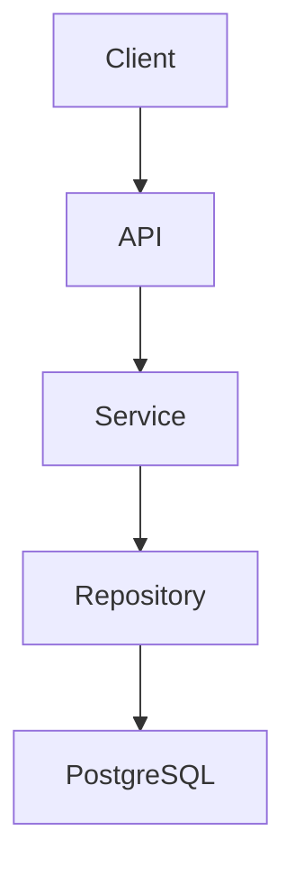

# Egentop-Core
Egentop-Core is a backend service for the Egentop project.

## Features
- Modular Clean Architecture
- REST API with versioning
- JWT authentication and role-based access control
- PostgreSQL persistence
- Dockerized local development
- Structured logging and centralized error handling
- Production-ready configuration management
- Comprehensive input validation

## Tech Stack
| Layer | Technology |
|--------|------------|
| Language | Go 1.26+ |
| HTTP Framework | Gin |
| Database | PostgreSQL |
| ORM/SQL | sqlc / pgx |
| Authentication | JWT |
| Validation | go-playground/validator/v10 |
| Containerization | Docker & Docker Compose |
| Testing | Go testing package |

## Architecture



## Quick Start

### Prerequisites
- Go 1.26+
- Docker
- Docker Compose
- Git

### Clone

```bash
git clone https://github.com/yourusername/yourproject.git
cd yourproject
```

### Configure

```bash
cp .env.example .env
```

### Start Dependencies

```bash
docker compose up -d
```

### Run

```bash
go run ./cmd/api
```

## Project Structure

```text
cmd/           Application entry points.
internal/      Private application code.
pkg/           Reusable packages.
docs/          Technical documentation.
scripts/       Development and deployment scripts.
deployments/   Deployment manifests and configurations.
```

## Documentation
- [Architecture](docs/architecture.md)
- [Development Setup](docs/development-setup.md)
- [API Documentation](docs/api/README.md)
- [Deployment Guide](docs/deployment.md)
- [Security Practices](docs/security.md)
- [Coding Standards](docs/coding-standards.md)
- [Roadmap](docs/roadmap.md)

## Development Workflow
1. Create a feature branch.
2. Implement changes.
3. Add or update tests.
4. Run validation and formatting.
5. Open a pull request.

## Roadmap
- [x] Core authentication
- [x] Validation framework
- [ ] API versioning
- [ ] Metrics and observability
- [ ] Multi-tenant support
- [ ] Web dashboard

## License
This project is licensed under the MIT License. See the LICENSE file for details.
